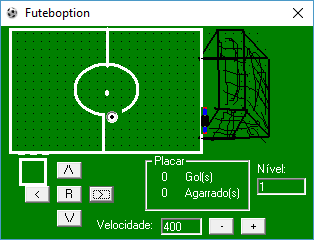
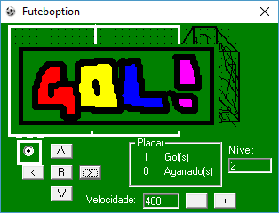

# Futboption
This game was made to study Visual Basic 6 when I was an intern.
It's a simple soccer game where you control the ball with the arrow keys on the screen.
As you score goals the game gets harder by moving the goalkeeper faster.

Screens:
-------

